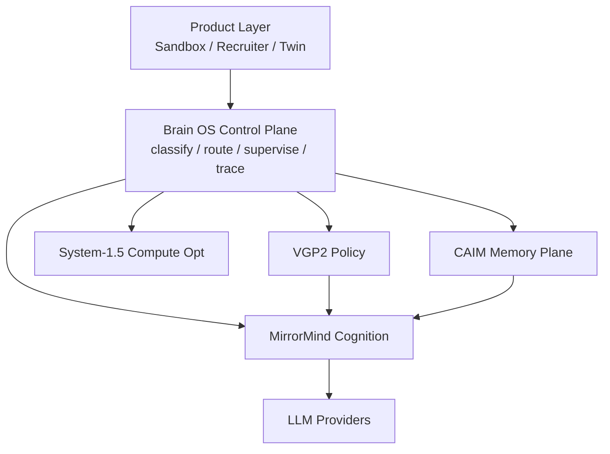

# Control Plane Overview

```mermaid
flowchart TB
    PL[Product Layer<br/>Sandbox / Recruiter / Twin]
    BO[Brain OS Control Plane<br/>classify / route / supervise / trace]
    MP[CAIM Memory Plane]
    CP[MirrorMind Cognition]
    OP[System-1.5 Compute Opt]
    PP[VGP2 Policy]
    LLM[LLM Providers]
    PL --> BO
    BO --> MP
    BO --> CP
    BO --> OP
    BO --> PP
    CP --> LLM
    PP --> CP
    MP --> CP
```

## Provenance

`source/Brain OS.docx` A.§3
