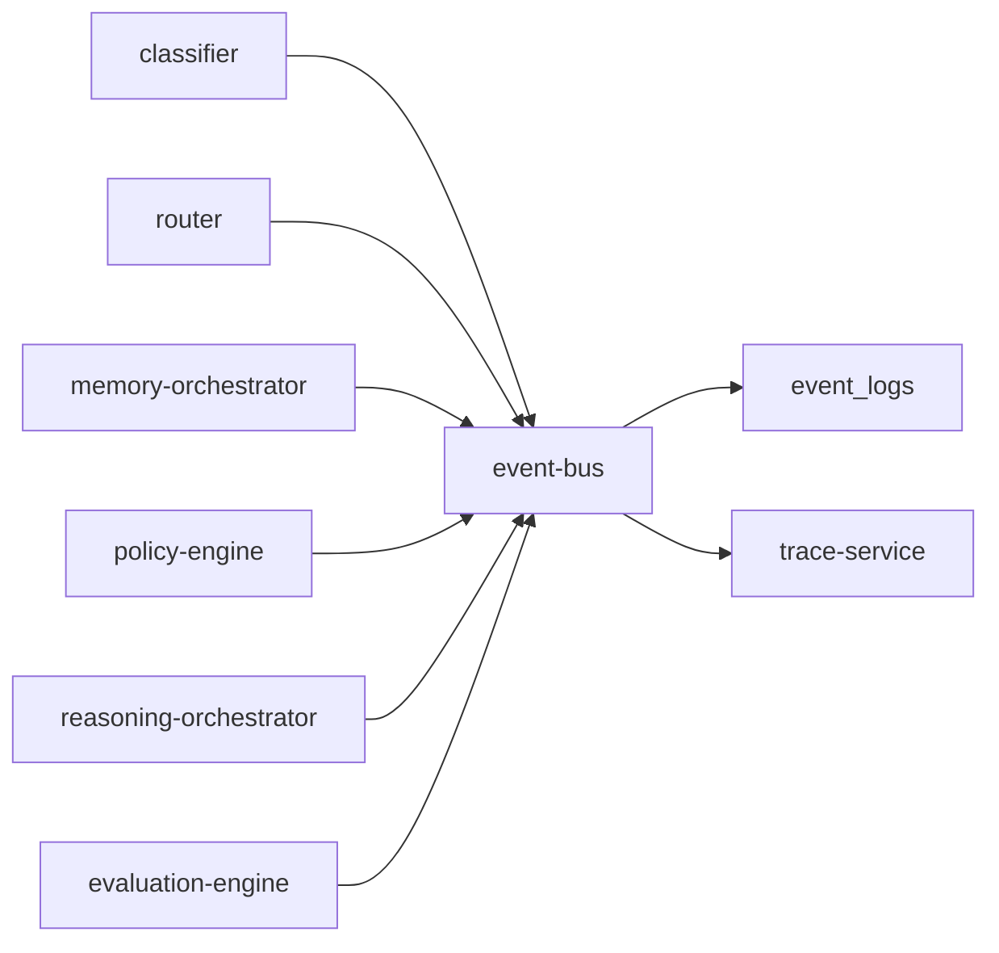

# Event-Driven Runtime

```mermaid
flowchart LR
    S1[classifier] --> EB[event-bus]
    S2[router] --> EB
    S3[memory-orchestrator] --> EB
    S4[policy-engine] --> EB
    S5[reasoning-orchestrator] --> EB
    S6[evaluation-engine] --> EB
    EB --> EL[event_logs]
    EB --> TS[trace-service]
```

## Provenance

`source/Brain OS.docx` F; service list
