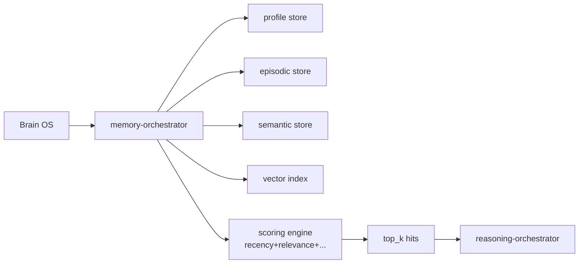

# Memory Orchestration

```mermaid
flowchart LR
    BO[Brain OS] --> MO[memory-orchestrator]
    MO --> PS[profile store]
    MO --> ES[episodic store]
    MO --> SS[semantic store]
    MO --> VI[vector index]
    MO --> SC[scoring engine<br/>recency+relevance+...]
    SC --> HITS[top_k hits]
    HITS --> RO[reasoning-orchestrator]
```

## Provenance

`source/Brain OS.docx` C.§4; D. memory/retrieve
