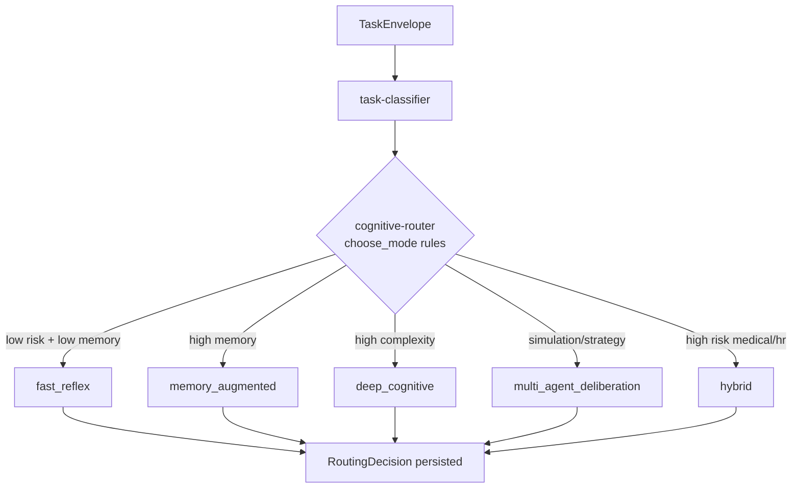

# Routing Flow

```mermaid
flowchart TD
    T[TaskEnvelope] --> C[task-classifier]
    C --> R{cognitive-router<br/>choose_mode rules}
    R -->|low risk + low memory| FR[fast_reflex]
    R -->|high memory| MA[memory_augmented]
    R -->|high complexity| DC[deep_cognitive]
    R -->|simulation/strategy| MAD[multi_agent_deliberation]
    R -->|high risk medical/hr| HY[hybrid]
    FR --> RD[RoutingDecision persisted]
    MA --> RD
    DC --> RD
    MAD --> RD
    HY --> RD
```

## Provenance

`source/Brain OS.docx` C.§2
