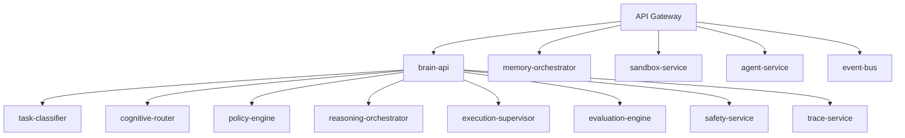

# Service Topology

```mermaid
flowchart TB
    GW[API Gateway]
    GW --> BA[brain-api]
    BA --> TC[task-classifier]
    BA --> CR[cognitive-router]
    BA --> PE[policy-engine]
    BA --> RO[reasoning-orchestrator]
    BA --> ES[execution-supervisor]
    BA --> EE[evaluation-engine]
    BA --> SS[safety-service]
    BA --> TR[trace-service]
    GW --> MO[memory-orchestrator]
    GW --> SB[sandbox-service]
    GW --> AG[agent-service]
    GW --> EB[event-bus]
```

## Provenance

`source/Brain OS.docx` C.§1
