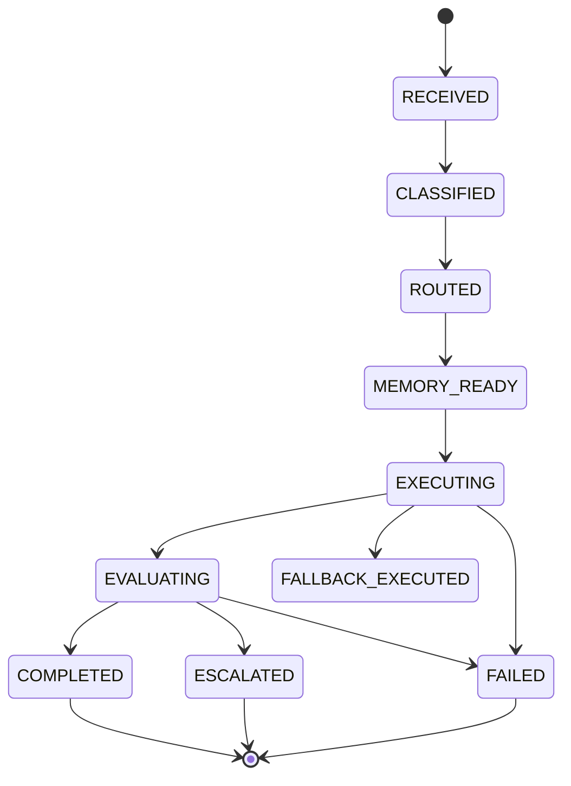

# Task Lifecycle

```mermaid
stateDiagram-v2
    [*] --> RECEIVED
    RECEIVED --> CLASSIFIED
    CLASSIFIED --> ROUTED
    ROUTED --> MEMORY_READY
    MEMORY_READY --> EXECUTING
    EXECUTING --> EVALUATING
    EVALUATING --> COMPLETED
    EXECUTING --> FALLBACK_EXECUTED
    EVALUATING --> ESCALATED
    EXECUTING --> FAILED
    EVALUATING --> FAILED
    COMPLETED --> [*]
    FAILED --> [*]
    ESCALATED --> [*]
```

## Provenance

`source/Brain OS.docx` C.§3
