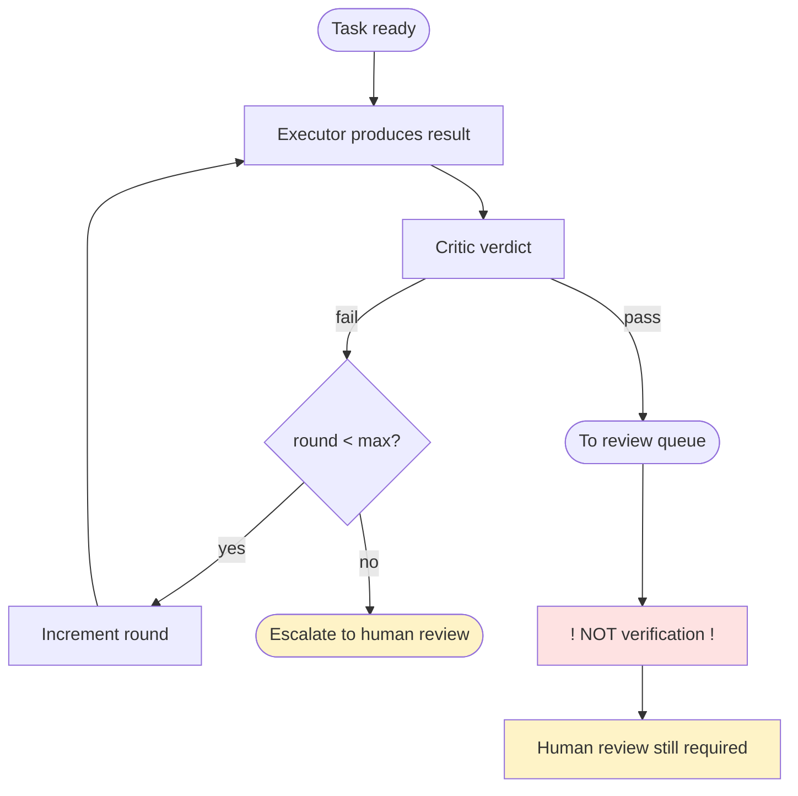

# Critique Loop Diagram

---
classification: operational-guidance
source_tier: operational-playbook
promotion_status: unreviewed
canonical_status: non-canonical
origin: swarm-playbooks
---

Max rounds in playbook sources: **2**.

See [critique/critic-loop.md](../critique/critic-loop.md) and [critique/critique-limitations.md](../critique/critique-limitations.md).
