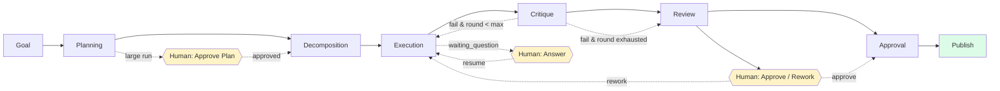

# Orchestration Lifecycle Diagram

---
classification: operational-guidance
source_tier: operational-playbook
promotion_status: unreviewed
canonical_status: non-canonical
origin: swarm-playbooks
---

## Legend

- Yellow: human intervention points
- Green: external effect phase
- Dotted: conditional paths

See [lifecycle/orchestration-lifecycle.md](../lifecycle/orchestration-lifecycle.md).
