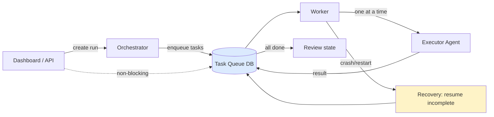

# Queue-Backed Execution Diagram

---
classification: operational-guidance
source_tier: operational-playbook
promotion_status: unreviewed
canonical_status: non-canonical
origin: swarm-playbooks
---

## Properties (from sources)

- Tasks processed without blocking UI
- Incomplete tasks picked up after backend restart
- Sequential processing default (playbook)

See [patterns/queue-backed-execution.md](../patterns/queue-backed-execution.md).
