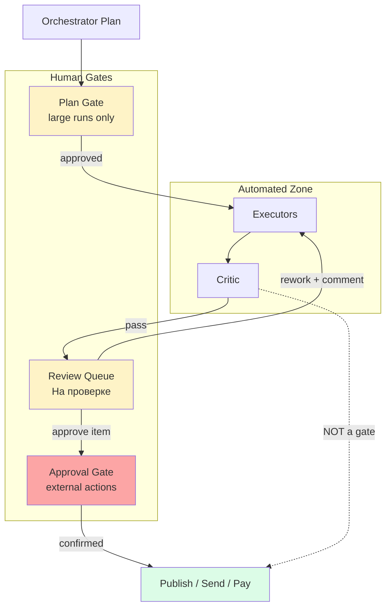

# Review Gates Diagram

---
classification: operational-guidance
source_tier: operational-playbook
promotion_status: unreviewed
canonical_status: non-canonical
origin: swarm-playbooks
---

## Key Rule

Critic output **never** connects directly to external effects.

See [hitl/human-approval-boundaries.md](../hitl/human-approval-boundaries.md).
