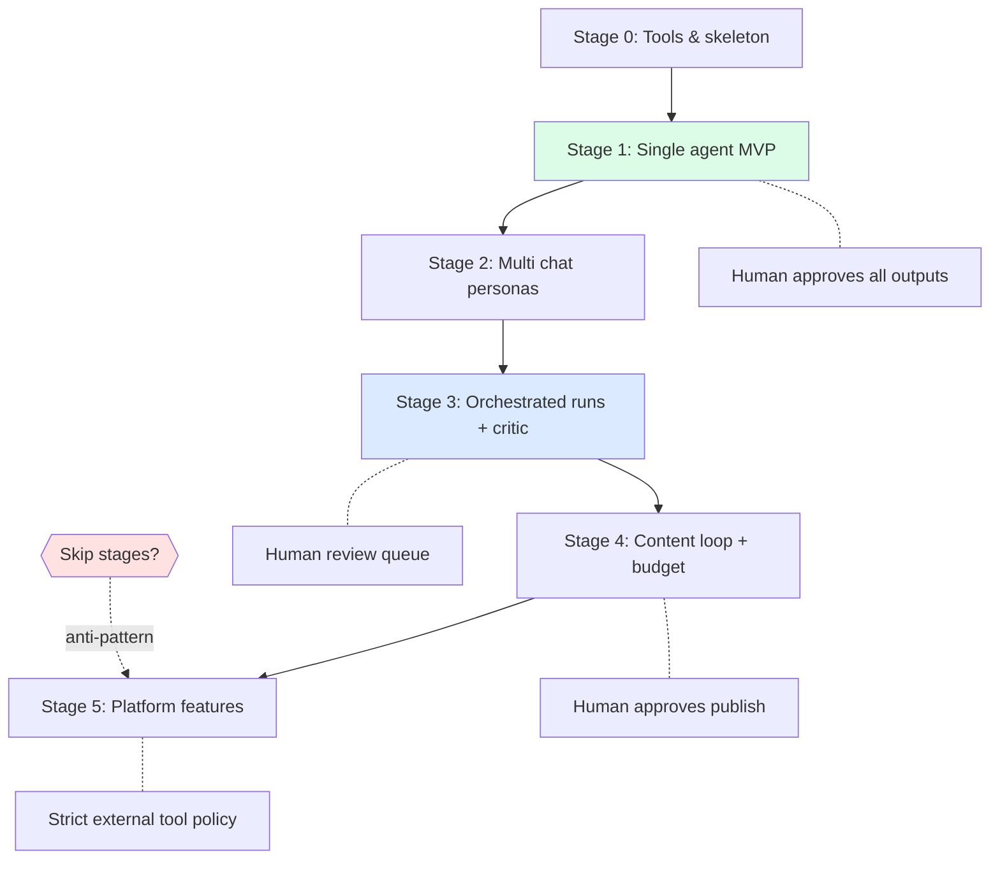

# Staged Autonomy Diagram

---
classification: operational-guidance
source_tier: operational-playbook
promotion_status: unreviewed
canonical_status: non-canonical
origin: swarm-playbooks
---

See [patterns/progressive-autonomy.md](../patterns/progressive-autonomy.md) and [anti-patterns/premature-agent-swarm.md](../anti-patterns/premature-agent-swarm.md).
