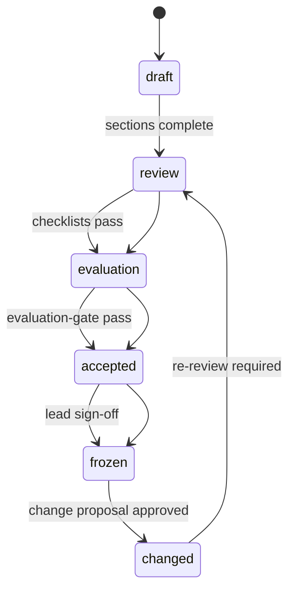

# Agent Template Lifecycle

## Notes

- **frozen** — no direct edits
- **changed** — only through [change-proposal-spec.md](../template-specs/change-proposal-spec.md)
- Rollback gate applies on every change from frozen

Reference: [template-lifecycle.md](../template-governance/template-lifecycle.md)
