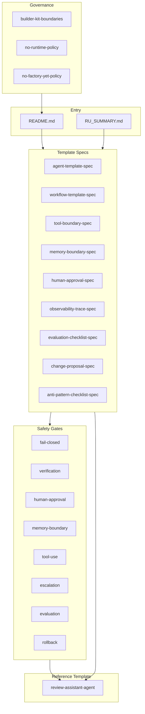

# Builder Kit Map

## Reading order

1. README / RU_SUMMARY
2. template-specs/agent-template-spec
3. safety-gates/
4. templates/review-assistant-agent/
5. evaluation-checklists/
6. governance/ (kit policies)
