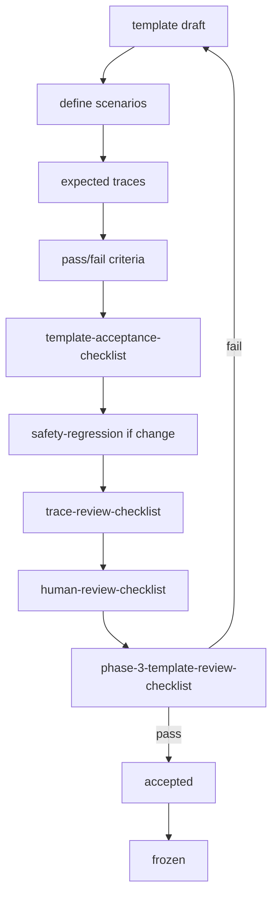

# Evaluation Flow

## Repository links

- Scenarios: `evaluation/scenarios/`
- Quality gates: `evaluation/quality-gates/`
- Kit checklists: [evaluation-checklists/](../evaluation-checklists/README.md)

No benchmark metrics in v0.1.
