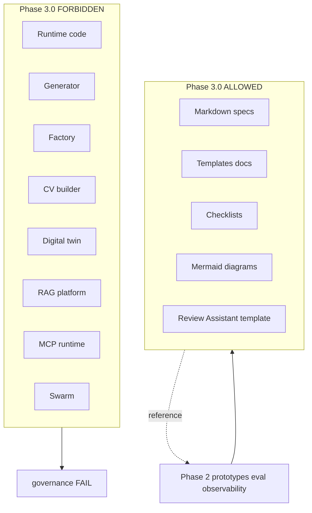

# Phase 3 Boundary

## Verdict label

**Agent Builder Kit v0.1** — specs only

Not: Agent Factory, Production Platform

Reference: [governance/phase-3-0-scope-lock.md](../governance/phase-3-0-scope-lock.md)
