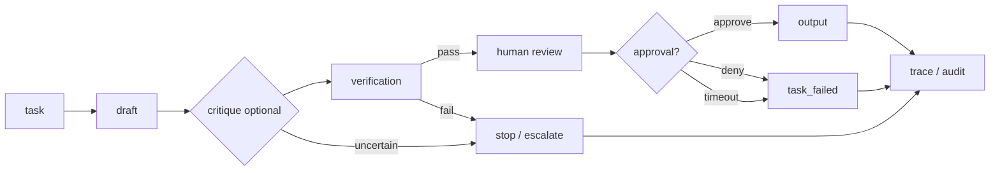

# Review Assistant Workflow

## Rules

- Critique is **advisory** — dashed mentally, not a gate replacement
- Human review **mandatory** before output
- No output on reject or timeout (deny-by-default)

Reference: [templates/review-assistant-agent/workflow.md](../templates/review-assistant-agent/workflow.md)
