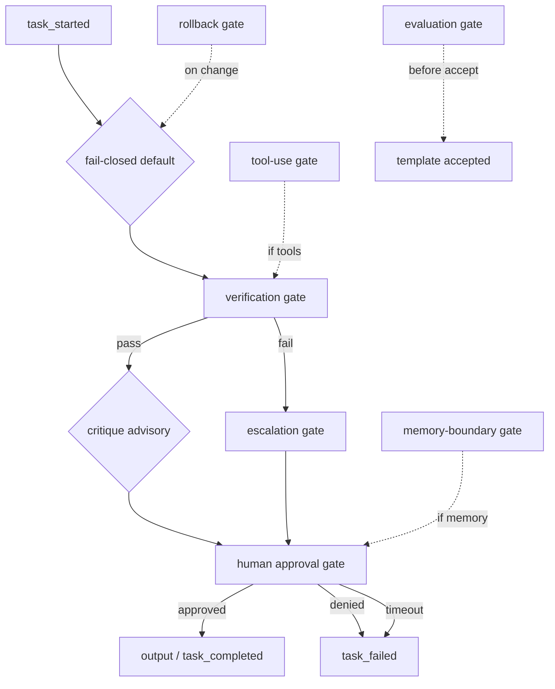

# Safety Gates Flow

```mermaid
flowchart TD
  START[task_started] --> FC{fail-closed default}
  FC --> VF[verification gate]
  VF -->|pass| CR{critique advisory}
  VF -->|fail| ES[escalation gate]
  CR --> HA[human approval gate]
  HA -->|approved| OUT[output / task_completed]
  HA -->|denied| FAIL[task_failed]
  HA -->|timeout| FAIL
  ES --> HA
  TU[tool-use gate] -.->|if tools| VF
  MB[memory-boundary gate] -.->|if memory| HA
  EV[evaluation gate] -.->|before accept| ACCEPT[template accepted]
  RB[rollback gate] -.->|on change| FC
```

## Legend

- Solid arrows — runtime workflow (conceptual)
- Dotted — design-time or conditional gates

Reference: [safety-gates/README.md](../safety-gates/README.md)
