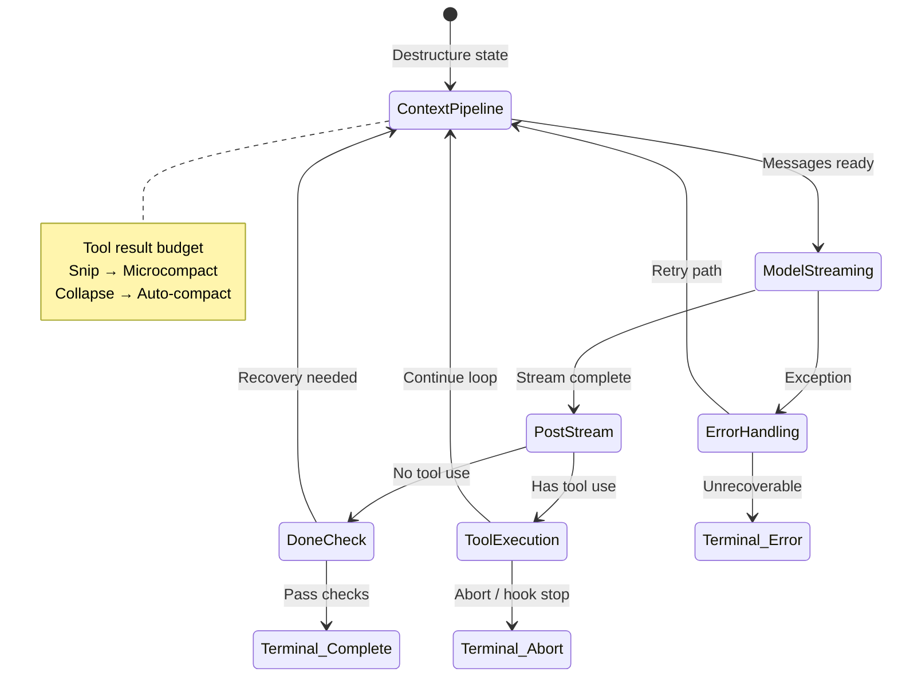

# Agent Loop State Diagram

Single iteration of the query loop — context pipeline through tool execution and termination checks.

## Related Concepts

- [[query-loop]]
- [[context-compression]]
- [[error-recovery-ladder]]
- [[terminal-states]]

## Sources

- `Books/claude/ch05-agent-loop.md`

## My Notes

