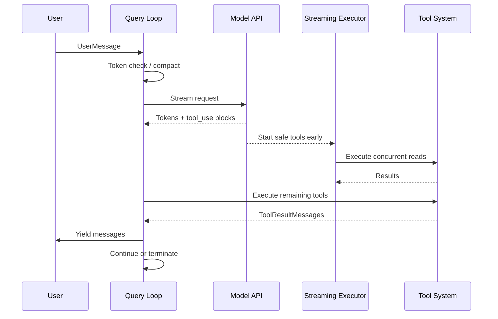

# Golden Path Sequence

End-to-end sequence from user message to rendered output.

## Related Concepts

- [[golden-path]]
- [[streaming-tool-executor]]
- [[tool-runtime]]

## Sources

- `Books/claude/ch01-architecture.md`

## My Notes

