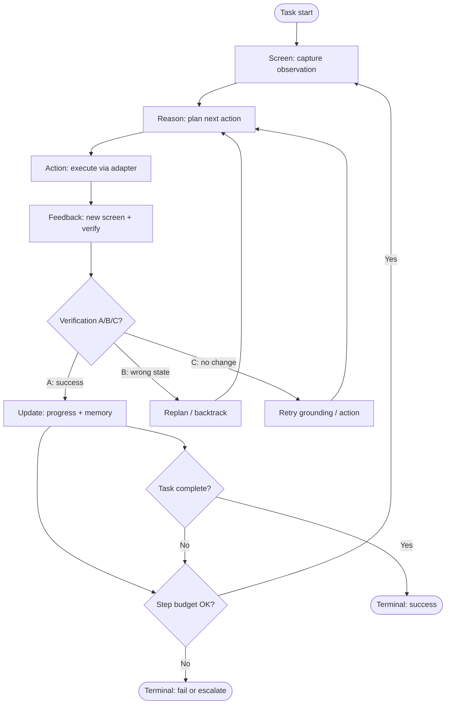

# GUI Agent Loop Diagram

Mermaid view of the embodied agent cycle promoted in [[gui-agent-loop]].



## Related Concepts

- [[gui-agent-loop]]
- [[visual-verification]]
- [[visual-grounding]]
- [[unverified-gui-clicks]]

## Semantic Cluster

gui-modality · verification

## Upstream Sources

- `experiments/mobile-agent-review/diagrams/gui-agent-loop.md`
- `agent-os/01_agent-runtime/gui-agent-loop.md`

## Governance References

- `governance/PROMOTION_LOG.md`

## Promotion Metadata

```yaml
maturity: reusable-pattern
promotion_decision: PROMOTE_NOW
source_tier: research
canonical_status: curated
```
