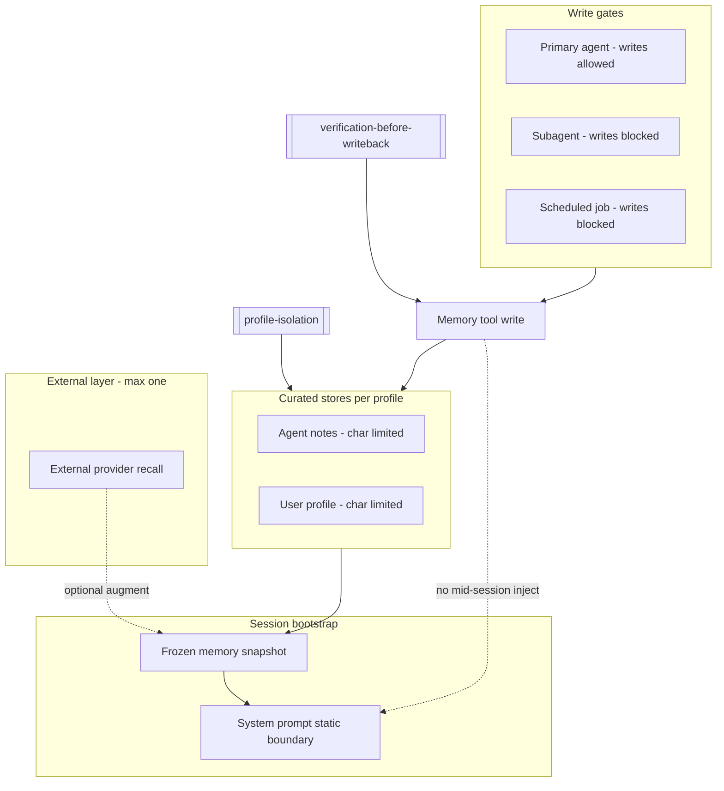

# Memory Governance Diagram

Mermaid view of bounded memory layers and injection policy.



## Related Concepts

- [[frozen-memory-snapshot]]
- [[memory-char-limits]]
- [[memory-provider-boundaries]]
- [[profile-isolation]]
- [[mid-session-memory-injection]]

## Semantic Cluster

memory-governance

## Upstream Sources

- `experiments/hermes-agent-review/memory/MEMORY_SYSTEM_OVERVIEW.md`
- `agent-os/02_memory/frozen-memory-snapshot.md`

## Governance References

- `governance/PROMOTION_LOG.md`

## Promotion Metadata

```yaml
maturity: reusable-pattern
promotion_decision: PROMOTE_NOW
source_tier: research
canonical_status: curated
```
