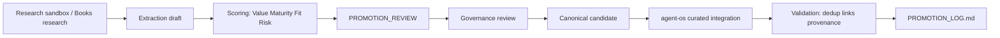

# Promotion Pipeline Diagram

Governed path from research to curated layer per `governance/PROMOTION_STRATEGY.md`.



## Related Concepts

- Phase 1.2 promoted notes in `agent-os/02_memory/`, `04_multi-agent/`, `08_patterns/`, `09_antipatterns/`

## Semantic Cluster

promotion-governance

## Upstream Sources

- `governance/PROMOTION_STRATEGY.md`
- `PROMOTION_REVIEW.md`

## Governance References

- `governance/PROMOTION_LOG.md`
- [graph/provenance-graph.md](../graph/provenance-graph.md)

## Promotion Metadata

```yaml
maturity: reusable-pattern
promotion_decision: PROMOTE_NOW
source_tier: research
canonical_status: curated
```
