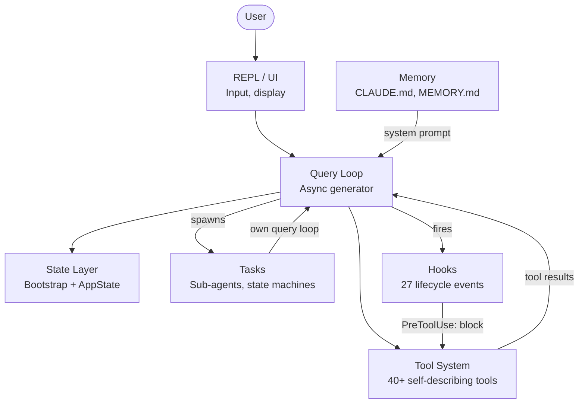

# Six Abstractions

Architecture diagram: the six core abstractions of a production agent runtime and their relationships.

## Related Concepts

- [[six-abstractions]]
- [[golden-path]]
- [[what-is-an-agent]]

## Sources

- `Books/claude/ch01-architecture.md`

## My Notes

