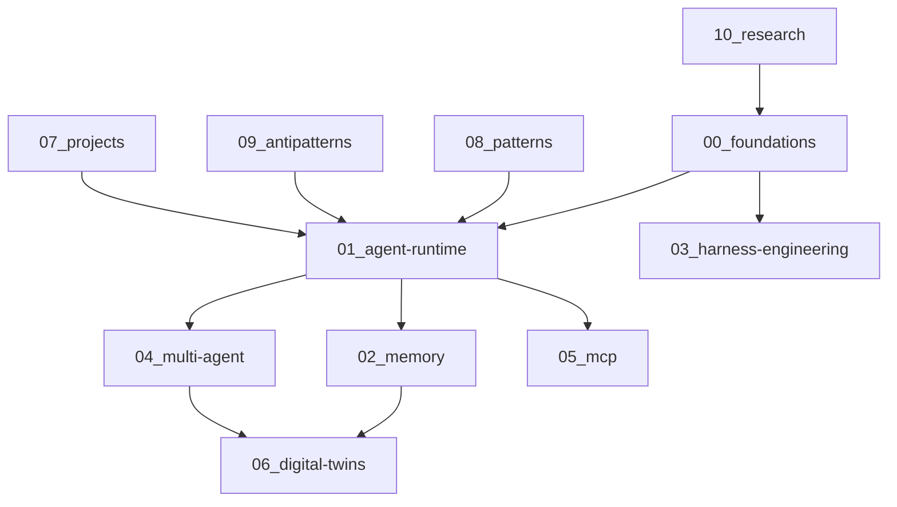
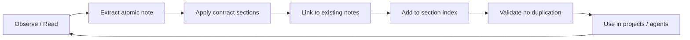

# Agent-OS

Engineering knowledge operating system for AI agents, harnesses, MCP ecosystems, and stateful agent runtimes.

## Purpose

This repository is not a notes collection. It is:

- a **production-grade knowledge base** for agent engineering
- a **reusable architecture system** for building and operating agents
- a **future RAG-ready** substrate (atomic notes, stable contracts, internal links)
- a **future MCP-ready** reference for tool protocols and orchestration
- a **future digital-twin-ready** foundation for persistent agent identity and memory
- **Cursor-friendly** (skills, rules, atomic markdown)
- **Obsidian-friendly** (wikilinks, folder taxonomy, index files)
- **Git-friendly** (kebab-case, one concept per file, no duplication)

Primary source corpus: decomposed insights from Claude Code architecture analysis in `Books/claude/`.

## System Overview

## Navigation Guide

| Directory | Scope | Start here |
|-----------|-------|------------|
| [00_foundations](00_foundations/index.md) | Core concepts: agent, harness, loops, verification | [what-is-an-agent](00_foundations/what-is-an-agent.md) |
| [01_agent-runtime](01_agent-runtime/index.md) | Query loop, tools, concurrency, lifecycle | [query-loop](01_agent-runtime/query-loop.md) |
| [02_memory](02_memory/index.md) | Semantic, episodic, long-term, compaction | [long-term-memory](02_memory/long-term-memory.md) |
| [03_harness-engineering](03_harness-engineering/index.md) | Permissions, hooks, verification, feedback | [harness-interface](03_harness-engineering/harness-interface.md) |
| [04_multi-agent](04_multi-agent/index.md) | Subagents, swarms, coordination | [subagents](04_multi-agent/subagents.md) |
| [05_mcp](05_mcp/index.md) | MCP protocol, transports, integrations | [mcp-protocol](05_mcp/mcp-protocol.md) |
| [06_digital-twins](06_digital-twins/index.md) | Identity, evolving memory, personas | [persistent-identity](06_digital-twins/persistent-identity.md) |
| [07_projects](07_projects/index.md) | Applied systems and experiments | [experiments](07_projects/experiments.md) |
| [08_patterns](08_patterns/index.md) | Reusable architecture patterns | [generator-loop-pattern](08_patterns/generator-loop-pattern.md) |
| [09_antipatterns](09_antipatterns/index.md) | Known failures | [infinite-retry-loops](09_antipatterns/infinite-retry-loops.md) |
| [10_research](10_research/index.md) | Research corpus, chapter catalog, extraction plans | [Research README](10_research/README.md) |
| [11_glossary](11_glossary/index.md) | Shared terminology | [agent](11_glossary/agent.md) |
| [12_diagrams](12_diagrams/index.md) | Mermaid architecture diagrams | [six-abstractions](12_diagrams/six-abstractions.md) |

## Architectural Philosophy

1. **One concept, one file** — atomic notes scale to 10,000+ entries without monoliths.
2. **Contracts over prose** — every note follows the same section structure for humans and RAG.
3. **Decomposition over aggregation** — concepts, patterns, anti-patterns, and projects stay separate.
4. **Links over duplication** — cross-reference; do not copy paragraphs across files.
5. **Production first** — every concept includes architecture and production implications.
6. **Sources preserved** — extracted ideas retain provenance to original material.

## Knowledge Lifecycle

### Adding a new note

1. Copy [templates/concept-note-template.md](templates/concept-note-template.md)
2. Place in the correct directory (concept vs pattern vs project)
3. Use kebab-case filename
4. Add wikilink to section `index.md`
5. Add `Related Concepts` links bidirectionally where relevant

### Note types

| Type | Location | Example |
|------|----------|---------|
| Concept | `00–06`, numbered dirs | `query-loop.md` |
| Pattern | `08_patterns/` | `withholding-errors.md` |
| Anti-pattern | `09_antipatterns/` | `central-orchestrator-god-object.md` |
| Research extract | `10_research/` | `claude-code-architecture.md` |
| Project | `07_projects/` | `neuro-secretary.md` |
| Glossary | `11_glossary/` | `harness.md` |
| Diagram | `12_diagrams/` | `agent-loop-state-diagram.md` |

## Quick Paths

- **Build an agent loop** → [query-loop](01_agent-runtime/query-loop.md) → [generator-loop-pattern](08_patterns/generator-loop-pattern.md) → [tool-runtime](01_agent-runtime/tool-runtime.md)
- **Add tools safely** → [self-describing-tools](08_patterns/self-describing-tools.md) → [permission-modes](03_harness-engineering/permission-modes.md) → [fail-closed-defaults](08_patterns/fail-closed-defaults.md)
- **Multi-agent** → [subagents](04_multi-agent/subagents.md) → [task-state-machine](04_multi-agent/task-state-machine.md) → [coordination](04_multi-agent/coordination.md)
- **MCP integration** → [mcp-protocol](05_mcp/mcp-protocol.md) → [tool-servers](05_mcp/tool-servers.md) → [runtime-bridges](05_mcp/runtime-bridges.md)
- **Persistent agent memory** → [long-term-memory](02_memory/long-term-memory.md) → [memory-recall](02_memory/memory-recall.md) → [evolving-memory](06_digital-twins/evolving-memory.md)
