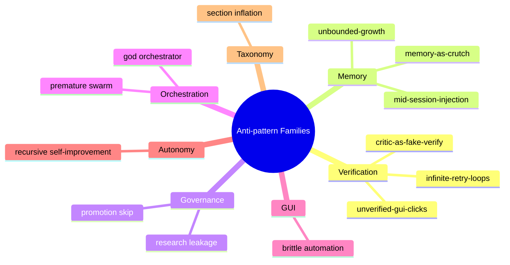

# Anti-pattern Families Diagram

```mermaid
mindmap
  root((Anti-pattern Families))
    Verification
      unverified-gui-clicks
      infinite-retry-loops
      critic-as-fake-verify
    Memory
      unbounded-growth
      mid-session-injection
      memory-as-crutch
    Governance
      promotion skip
      research leakage
    Orchestration
      god orchestrator
      premature swarm
    GUI
      brittle automation
    Autonomy
      recursive self-improvement
    Taxonomy
      section inflation
```

Mitigation hub: [anti-pattern-families.md](../anti-pattern-families.md)
