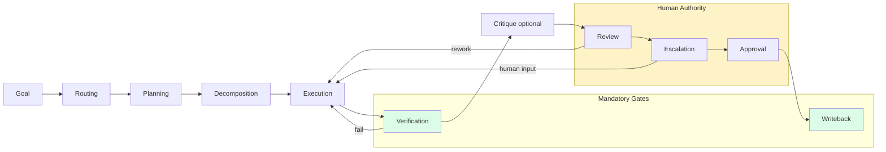

# Canonical Lifecycle Diagram

```mermaid
flowchart LR
    G[Goal] --> R[Routing]
    R --> P[Planning]
    P --> D[Decomposition]
    D --> E[Execution]
    E --> V[Verification]
    V --> C[Critique optional]
    C --> RV[Review]
    RV --> ES[Escalation]
    ES --> AP[Approval]
    AP --> W[Writeback]

    V -->|fail| E
    RV -->|rework| E
    ES -->|human input| E

    subgraph mandatory [Mandatory Gates]
        V
        W
    end

    subgraph human [Human Authority]
        RV
        AP
        ES
    end

    style V fill:#dcfce7
    style W fill:#dcfce7
    style human fill:#fef3c7
```

See [operational-lifecycle.md](../operational-lifecycle.md).
