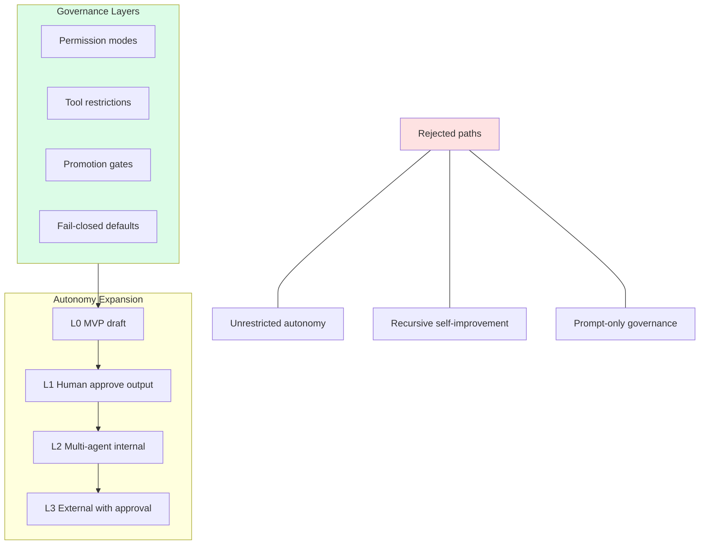

# Governance-before-autonomy Diagram

```mermaid
flowchart TB
    subgraph governance [Governance Layers]
        PM[Permission modes]
        TR[Tool restrictions]
        PG[Promotion gates]
        FC[Fail-closed defaults]
    end

    subgraph autonomy [Autonomy Expansion]
        L0[L0 MVP draft]
        L1[L1 Human approve output]
        L2[L2 Multi-agent internal]
        L3[L3 External with approval]
    end

    governance --> L0
    L0 --> L1
    L1 --> L2
    L2 --> L3

    REJ[Rejected paths]
    REJ --- UA[Unrestricted autonomy]
    REJ --- RSI[Recursive self-improvement]
    REJ --- POG[Prompt-only governance]

    style REJ fill:#fee2e2
    style governance fill:#dcfce7
```

See [governance-before-autonomy.md](../governance-before-autonomy.md).
