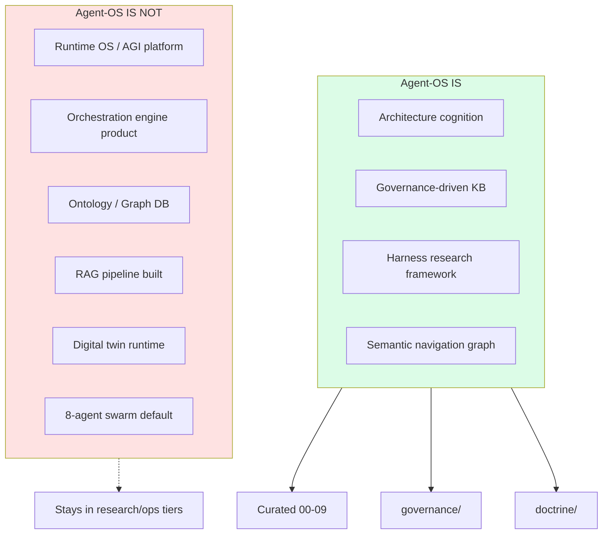

# System Positioning Diagram

```mermaid
flowchart TB
    subgraph IS [Agent-OS IS]
        A1[Architecture cognition]
        A2[Governance-driven KB]
        A3[Harness research framework]
        A4[Semantic navigation graph]
    end

    subgraph ISNOT [Agent-OS IS NOT]
        B1[Runtime OS / AGI platform]
        B2[Orchestration engine product]
        B3[Ontology / Graph DB]
        B4[RAG pipeline built]
        B5[Digital twin runtime]
        B6[8-agent swarm default]
    end

    IS --> CURATED[Curated 00-09]
    IS --> GOV[governance/]
    IS --> DOC[doctrine/]

    ISNOT -.-> RESEARCH[Stays in research/ops tiers]

    style IS fill:#dcfce7
    style ISNOT fill:#fee2e2
```

See [system-positioning.md](../system-positioning.md).
