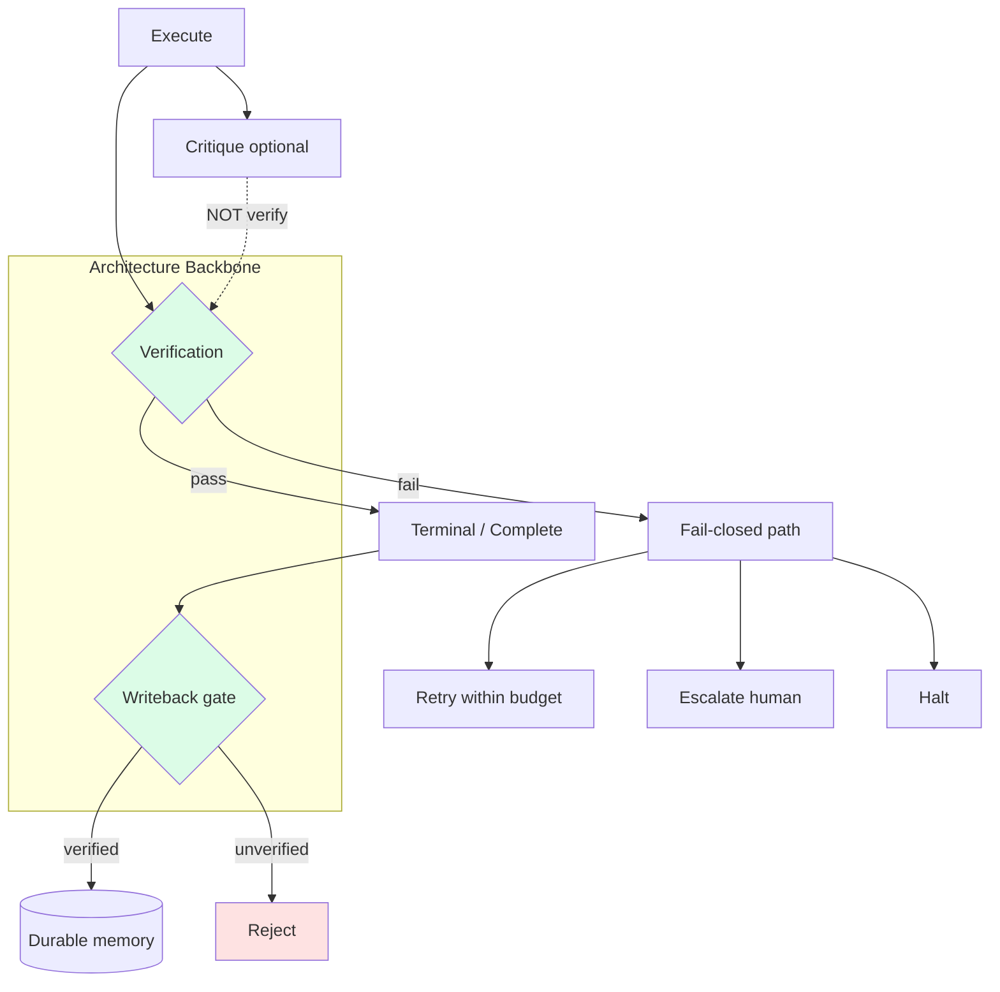

# Verification-first Diagram

```mermaid
flowchart TB
    EX[Execute] --> VF{Verification}
    VF -->|pass| TM[Terminal / Complete]
    VF -->|fail| FC[Fail-closed path]
    FC --> RT[Retry within budget]
    FC --> ES[Escalate human]
    FC --> HL[Halt]

    EX --> CR[Critique optional]
    CR -.->|NOT verify| VF

    TM --> WB{Writeback gate}
    WB -->|verified| MEM[(Durable memory)]
    WB -->|unverified| REJ[Reject]

    subgraph backbone [Architecture Backbone]
        VF
        WB
    end

    style VF fill:#dcfce7
    style WB fill:#dcfce7
    style REJ fill:#fee2e2
```

See [verification-first.md](../verification-first.md).
