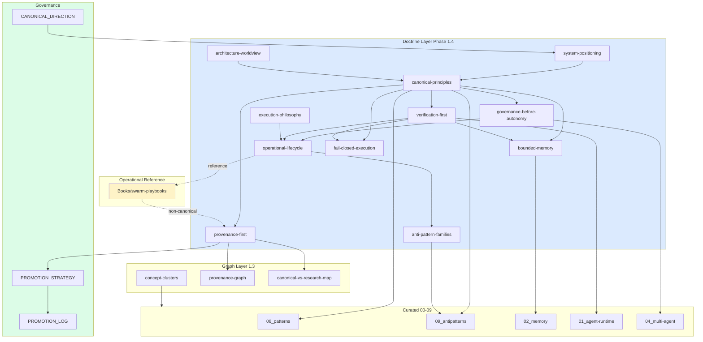

# Doctrine Map

Relationships between principles, lifecycle, anti-patterns, governance, graph layer, and operational reference tier.

---

## Principle → Lifecycle Stage

| Principle | Primary lifecycle stages |
|-----------|-------------------------|
| Verification-first | execution, verification, writeback |
| Governance-before-autonomy | routing, planning, approval |
| Fail-closed | execution, verification |
| Bounded memory | writeback |
| Provenance-first | goal (source selection), promotion (meta) |
| Human escalation | review, escalation, approval |
| Modality-unified | execution |
| Research isolation | goal, routing |

---

## Principle → Cluster

| Principle | Semantic cluster |
|-----------|------------------|
| Verification-first | verification |
| Bounded memory | memory-governance |
| Governance-before-autonomy | orchestration + promotion-governance |
| Modality-unified | gui-modality + agent-runtime |

Indexes: [cluster-navigation](../graph/navigation/cluster-navigation.md)

---

## Anti-pattern Family → Principle

| Family | Principles violated |
|--------|---------------------|
| Verification failures | Verification-first, Fail-closed |
| Memory failures | Bounded memory, Verification-first |
| Governance failures | Provenance-first, Promotion discipline |
| Orchestration failures | Governance-before-autonomy |
| Autonomy failures | Governance-before-autonomy |
| Taxonomy failures | Research isolation, Anti-pattern adjacency |

---

## Layer Boundaries

| From | To | Allowed |
|------|-----|---------|
| doctrine | curated | wikilink + synthesis |
| doctrine | governance | path reference |
| doctrine | swarm-playbooks | path reference only |
| curated | research | path + (research) label |
| swarm | curated | **forbidden** without promotion |

---

## Sources

- [doctrine/README.md](README.md)
- [graph/concept-clusters.md](../graph/concept-clusters.md)
- [governance/CONSOLIDATION_CANDIDATES.md](../../governance/CONSOLIDATION_CANDIDATES.md)
