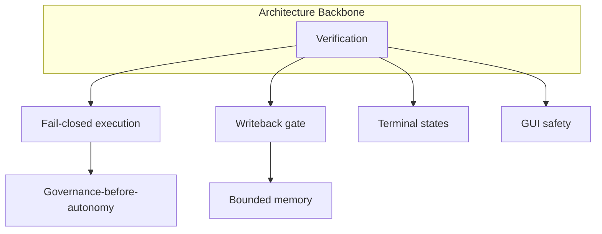

# Verification-first Doctrine

Why verification is the **architecture backbone** of Agent-OS — not an optional QA step.

---

## Core Thesis

Agent systems fail at the boundary between **claimed completion** and **actual completion**. Verification is the harness layer that holds that boundary. Without it:

- loops terminate on model self-report
- GUI transport success masquerades as task progress
- durable memory absorbs hallucinations
- critics are mistaken for truth engines

Everything else — memory bounds, governance, fail-closed — **assumes** verification exists.

---

## Consolidated Verification Stack

### 1. Foundational verification

[[verification]] — hooks, classifiers, subagents, tests — modality-agnostic “done?” question.

### 2. Execution verification

[[execution-verification]] — harness-level outcome checks before exit; pairs with [[execution-feedback]].

### 3. Visual verification

[[visual-verification]] — post-action UI delta with explicit outcome taxonomy (GUI modality).

### 4. Verification before writeback

[[verification-before-writeback]] — durable stores require higher evidence bar:

```
EXECUTE → VERIFY → (pass) → WRITEBACK → (fail) → discard | retry | escalate
```

### 5. Fail-closed agent loop

[[fail-closed-agent-loop]] — verification failure blocks terminal state and unchecked side effects.

---

## Critique vs Verification (Mandatory)

| | Critique | Verification |
|---|----------|--------------|
| Actor | Often LLM critic (operational) | Harness, tests, visual delta, human |
| Guarantees | None | Bounded by method |
| Role | Heuristic pre-filter | Architecture gate |
| In curated layer | Not promoted as verify | Core invariant |

**Critic ≠ truth.** Operational corpus (`Books/swarm-playbooks/critique/`) documents limits; doctrine adopts that boundary.

Promoting critic-as-verification is **NEVER PROMOTE** (NR4).

---

## Fail-closed Loops

Verification-first **requires** fail-closed behavior:

- Tool layer: [[fail-closed-defaults]]
- Loop layer: [[fail-closed-agent-loop]]
- Writeback layer: reject unverified payloads
- GUI: circuit breaker on repeated C outcomes ([[unverified-gui-clicks]] inverse)

Fail-open “for speed” in dev propagates to production incidents.

---

## Escalation Requirements

When automated verification cannot resolve:

- Retry within budget ([[infinite-retry-loops]] inverse)
- Escalate to human for high-risk domains
- Halt rather than default success

human-escalation-gate (Brain OS research) — aligned intent; **not curated** until contract spec.

---

## Verification Cluster (Semantic)

Curated nodes ([verification-cluster](../graph/cluster-indexes/verification-cluster.md)):

- [[visual-verification]]
- [[verification-before-writeback]]
- [[fail-closed-agent-loop]]
- [[verification]]
- [[execution-verification]]
- [[execution-feedback]]

Research adjacency only: trace-first-architecture, human-escalation-gate.

---

## Why Verification Is Backbone



Without verification:

- fail-closed has nothing to close on
- writeback cannot discriminate truth
- governance approves uninspected artifacts
- memory bounds store garbage efficiently

---

## Production Realism

- Tune gates per store type — over-strict blocks learning
- Audit: what verified, what rejected, which gate failed
- Separate metrics for critique pass-rate vs verification pass-rate
- Never report critic agreement as ground-truth SLA

---

## Sources

- `agent-os/00_foundations/verification.md`
- `agent-os/00_foundations/visual-verification.md`
- `agent-os/08_patterns/verification-before-writeback.md`
- `agent-os/08_patterns/fail-closed-agent-loop.md`
- `Books/swarm-playbooks/critique/critique-vs-verification.md`
- `governance/CONSOLIDATION_CANDIDATES.md`
- `governance/SEMANTIC_DRIFT_ANALYSIS.md`

See also: [diagrams/verification-first.md](diagrams/verification-first.md)
