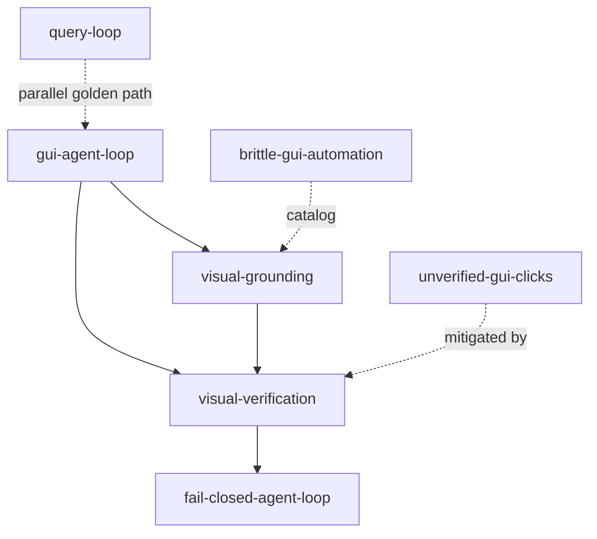

# GUI Modality Map

**Cluster:** gui-modality  
**Index:** [gui-modality-cluster](../cluster-indexes/gui-modality-cluster.md)

---

## Cluster Description

Embodied agent loop as modality extension parallel to code [[query-loop]] — observe, ground, act, verify.

## Core Concepts

| Concept | Role |
|---------|------|
| [[gui-agent-loop]] | Screen→reason→action→feedback |
| [[visual-grounding]] | Intent → spatial target |
| [[visual-verification]] | A/B/C post-action |
| [[query-loop]] | Code golden path (parallel) |

## Adjacency

## Upstream Sources

- `experiments/mobile-agent-review/extracted-patterns/*`
- `Books/agents/` (harness survey environment modeling — research catalog)

## Dangerous Drifts

- GUI without verification stage
- OCR-list as ground truth
- Sleep-based sync vs observation wait
- Creating `13_gui-agents/` section prematurely

## Anti-Pattern Neighbors

- [[unverified-gui-clicks]]
- [[brittle-gui-automation]]

## Governance Notes

- No ADB/runtime links in curated layer
- MCP GUI hybrid — RESEARCH_ONLY

## Up

- [concept-clusters.md](../concept-clusters.md)
