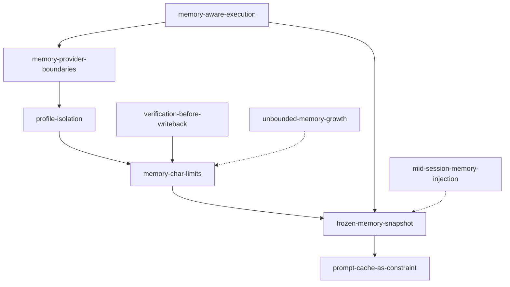

# Memory Governance Map

**Cluster:** memory-governance  
**Index:** [memory-governance-cluster](../cluster-indexes/memory-governance-cluster.md)

---

## Cluster Description

Bounded curated memory with safe injection timing, profile isolation, and single external provider boundary.

## Core Concepts

| Concept | Role |
|---------|------|
| [[frozen-memory-snapshot]] | Inject once at bootstrap |
| [[memory-char-limits]] | Hard bounds + consolidation |
| [[profile-isolation]] | Per-instance store separation |
| [[memory-provider-boundaries]] | One external + write gates |
| [[memory-aware-execution]] | Recall depth by task need |
| [[memory-taxonomy]] | Claude four-type filter |

## Adjacency

## Upstream Sources

- `experiments/hermes-agent-review/memory/*`
- `Books/claude/ch11-memory.md`
- `Books/brain-os/patterns/memory-aware-routing.md` (stripped)

## Dangerous Drifts

- Mid-session prompt rebuild on memory write
- Multiple external providers active
- Subagent/cron writes to user profile
- Unbounded store without consolidation

## Anti-Pattern Neighbors

- [[mid-session-memory-injection]]
- [[unbounded-memory-growth]]
- [[memory-as-crutch]]
- [[cache-busting-sections]]

## Governance Notes

- No Honcho/provider matrix as canonical
- Profile in `02_memory/` by Phase 1.2 placement — link [[persistent-identity]] for session IDs

## Up

- [concept-clusters.md](../concept-clusters.md)
