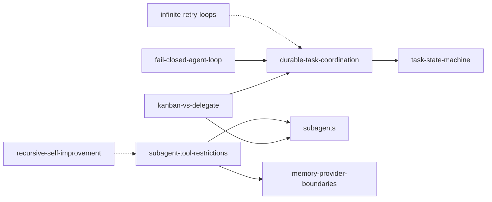

# Orchestration Map

**Cluster:** orchestration  
**Index:** [orchestration-cluster](../cluster-indexes/orchestration-cluster.md)

---

## Cluster Description

Choosing delegation vs durable queue, restricting subagent side effects, coordinating long-running multi-role work.

## Core Concepts

| Concept | Role |
|---------|------|
| [[kanban-vs-delegate]] | Primitive decision matrix |
| [[durable-task-coordination]] | Persistent queue semantics |
| [[subagent-tool-restrictions]] | Child agent safety boundary |
| [[subagents]] | Ephemeral child instances |
| [[task-state-machine]] | Task lifecycle |
| [[fail-closed-agent-loop]] | No silent completion on blocked work |

## Adjacency

## Upstream Sources

- `experiments/hermes-agent-review/multi-agent/*`
- `Books/claude/ch08-sub-agents.md`, ch10

## Dangerous Drifts

- Delegate for multi-day durable work
- Kanban for instant parent-blocked lookup
- Recursive delegation enabled
- Missing failure_limit on queue tasks

## Anti-Pattern Neighbors

- [[recursive-self-improvement]]
- [[infinite-retry-loops]]
- [[central-orchestrator-god-object]]

## Governance Notes

- human-escalation-gate (Brain OS) — research adjacency for high-risk domains
- Kanban comment protocol detail — PROMOTE_LATER

## Up

- [concept-clusters.md](../concept-clusters.md)
