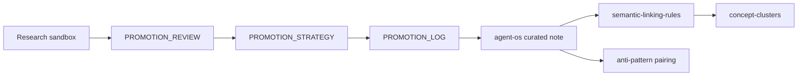

# Promotion Governance Map

**Cluster:** promotion-governance  
**Index:** [promotion-governance-cluster](../cluster-indexes/promotion-governance-cluster.md)

---

## Cluster Description

Controlled path from research sandboxes to curated notes — scoring, governance approval, provenance logging, anti-pattern pairing.

## Core Concepts

| Artifact | Role |
|----------|------|
| `PROMOTION_REVIEW.md` | Scored candidates Phase 1.1 |
| `governance/PROMOTION_STRATEGY.md` | Pipeline policy |
| `governance/PROMOTION_LOG.md` | Audit table |
| [provenance-graph](../provenance-graph.md) | Lineage visualization |
| [canonical-vs-research-map](../canonical-vs-research-map.md) | Layer separation |
| [semantic-linking-rules](../semantic-linking-rules.md) | Link discipline |

## Adjacency

## Upstream Sources

- Phase 1.1 review methodology
- `governance/CANONICAL_DIRECTION.md`
- `governance/KNOWLEDGE_GRAPH_DIRECTION.md`

## Dangerous Drifts

- Direct experiment → agent-os copy skipping review
- Research marked canonical in sources.md
- Promoting REJECT or RESEARCH_ONLY items
- Auto-merge comparison tables losing provenance

## Anti-Pattern Neighbors

- Taxonomy explosion (empty new sections)
- Concept inflation without scoring
- Brain OS branding as canonical nodes

## Governance Notes

- Phase 1.3 adds graph layer — still documentation only
- Every PROMOTE_NOW from 1.2 must appear in PROMOTION_LOG + provenance-graph

## Up

- [concept-clusters.md](../concept-clusters.md)
