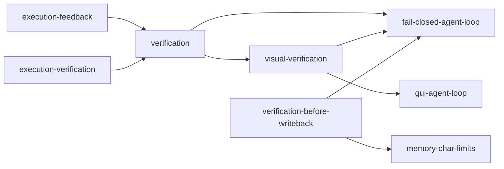

# Verification Map

**Cluster:** verification  
**Index:** [verification-cluster](../cluster-indexes/verification-cluster.md)

---

## Cluster Description

Trust gates before loop termination and before durable writeback. Spans code harness (hooks, feedback) and GUI modality (A/B/C reflect).

## Core Concepts

| Concept | Role |
|---------|------|
| [[verification]] | Foundation — done-state challenge |
| [[visual-verification]] | GUI A/B/C taxonomy |
| [[verification-before-writeback]] | Durable store gate |
| [[fail-closed-agent-loop]] | Loop stays open on verify fail |
| [[execution-feedback]] | Harness → model next turn |
| [[execution-verification]] | Tool/stop hook verification |

## Adjacency

## Upstream Sources

- `Books/claude/ch05-agent-loop.md`, ch08
- `experiments/mobile-agent-review/extracted-patterns/action-verification-pattern.md`
- `Books/brain-os/patterns/evaluation-before-writeback.md` (stripped → verification-before-writeback)

## Dangerous Drifts

- Treating model self-report as verification pass
- Disabling GUI reflect for latency
- Writeback without eval gate
- Promoting trace-first as canonical without trace contract spec

## Anti-Pattern Neighbors

- [[unverified-gui-clicks]]
- [[infinite-retry-loops]]
- [[unbounded-memory-growth]] (unverified writes)

## Governance Notes

- Brain OS `trace-first-architecture`, `human-escalation-gate` — **research adjacency only**
- GUI verification extends but does not replace code [[verification]]

## Up

- [concept-clusters.md](../concept-clusters.md)
