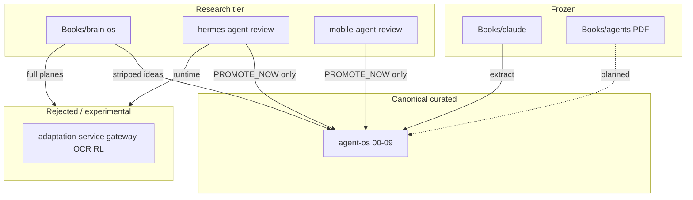

# Canonical vs Research Diagram

```mermaid
flowchart TB
    subgraph frozen [Frozen]
        CL[Books/claude]
        AG[Books/agents PDF]
    end

    subgraph research [Research tier]
        BO[Books/brain-os]
        EX1[hermes-agent-review]
        EX2[mobile-agent-review]
    end

    subgraph curated [Canonical curated]
        AO[agent-os 00-09]
    end

    subgraph blocked [Rejected / experimental]
        RJ[adaptation-service gateway OCR RL]
    end

    CL -->|extract| AO
    EX1 -->|PROMOTE_NOW only| AO
    EX2 -->|PROMOTE_NOW only| AO
    BO -->|stripped ideas| AO
    BO -->|full planes| blocked
    EX1 -->|runtime| blocked
    AG -. planned .-> AO
```

## Up

- [canonical-vs-research-map.md](../canonical-vs-research-map.md)
