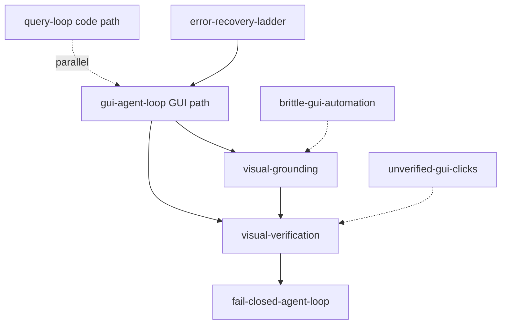

# GUI Modality Cluster Diagram

```mermaid
flowchart TD
    QL[query-loop code path] 
    GAL[gui-agent-loop GUI path]
    QL -. parallel .-> GAL
    GAL --> VG[visual-grounding]
    GAL --> VV[visual-verification]
    VG --> VV
    VV --> FCL[fail-closed-agent-loop]
    UGC[unverified-gui-clicks] -.-> VV
    BGA[brittle-gui-automation] -.-> VG
    ERL[error-recovery-ladder] --> GAL
```

## Up

- [gui-modality-cluster.md](../cluster-indexes/gui-modality-cluster.md)
