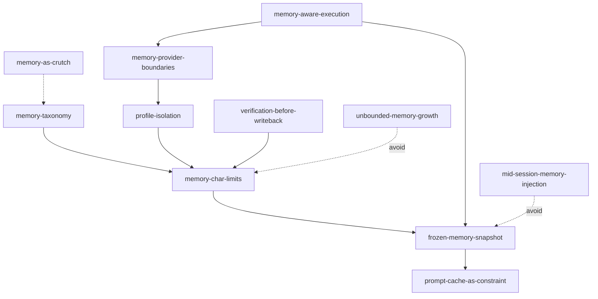

# Memory Governance Cluster Diagram

```mermaid
flowchart TB
    MT[memory-taxonomy] --> MCL[memory-char-limits]
    MCL --> FMS[frozen-memory-snapshot]
    FMS --> PCC[prompt-cache-as-constraint]
    PI[profile-isolation] --> MCL
    MPB[memory-provider-boundaries] --> PI
    MAE[memory-aware-execution] --> FMS
    MAE --> MPB
    VBW[verification-before-writeback] --> MCL
    MSI[mid-session-memory-injection] -.->|avoid| FMS
    UMG[unbounded-memory-growth] -.->|avoid| MCL
    MAC[memory-as-crutch] -.-> MT
```

## Up

- [memory-governance-cluster.md](../cluster-indexes/memory-governance-cluster.md)
