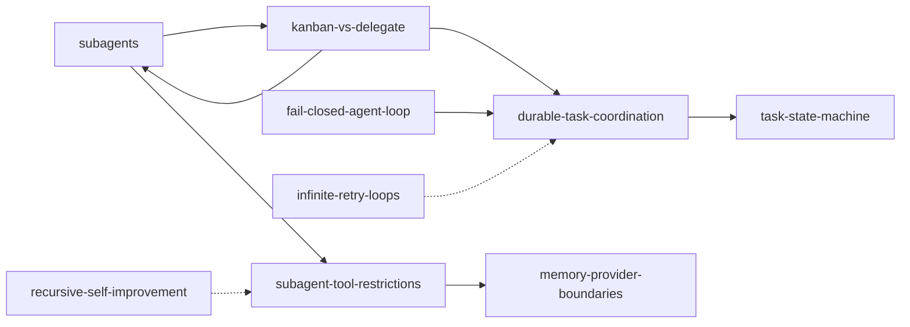

# Orchestration Cluster Diagram

```mermaid
flowchart LR
    SUB[subagents] --> STR[subagent-tool-restrictions]
    SUB --> KVD[kanban-vs-delegate]
    KVD --> DTC[durable-task-coordination]
    KVD --> SUB
    DTC --> TSM[task-state-machine]
    STR --> MPB[memory-provider-boundaries]
    FCL[fail-closed-agent-loop] --> DTC
    RSI[recursive-self-improvement] -.-> STR
    IRL[infinite-retry-loops] -.-> DTC
```

## Up

- [orchestration-cluster.md](../cluster-indexes/orchestration-cluster.md)
