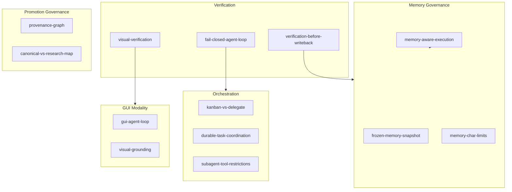

# Semantic Clusters Overview

```mermaid
graph TB
    subgraph verification [Verification]
        VV[visual-verification]
        VBW[verification-before-writeback]
        FCL[fail-closed-agent-loop]
    end

    subgraph memory [Memory Governance]
        FMS[frozen-memory-snapshot]
        MCL[memory-char-limits]
        MAE[memory-aware-execution]
    end

    subgraph orch [Orchestration]
        KVD[kanban-vs-delegate]
        DTC[durable-task-coordination]
        STR[subagent-tool-restrictions]
    end

    subgraph gui [GUI Modality]
        GAL[gui-agent-loop]
        VG[visual-grounding]
    end

    subgraph promo [Promotion Governance]
        PG[provenance-graph]
        CVR[canonical-vs-research-map]
    end

    VBW --> memory
    FCL --> orch
    VV --> gui
    MAE --> memory
```

## Up

- [concept-clusters.md](../concept-clusters.md)
- [cluster-navigation.md](../navigation/cluster-navigation.md)
