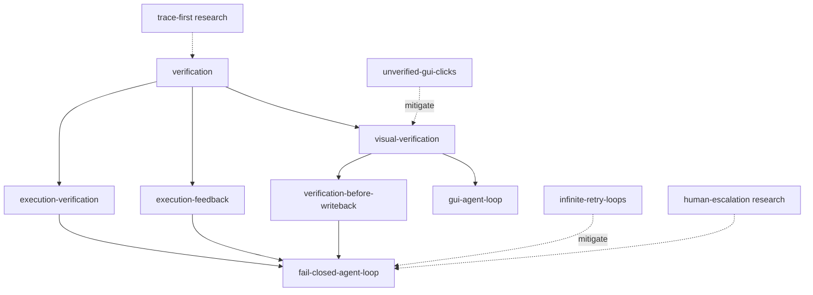

# Verification Cluster Diagram

```mermaid
flowchart TB
    VER[verification] --> EV[execution-verification]
    VER --> EF[execution-feedback]
    VER --> VV[visual-verification]
    VV --> VBW[verification-before-writeback]
    VBW --> FCL[fail-closed-agent-loop]
    EV --> FCL
    EF --> FCL
    VV --> GAL[gui-agent-loop]
    UGC[unverified-gui-clicks] -.->|mitigate| VV
    IRL[infinite-retry-loops] -.->|mitigate| FCL
    TF[trace-first research] -.-> VER
    HEG[human-escalation research] -.-> FCL
```

## Up

- [verification-cluster.md](../cluster-indexes/verification-cluster.md)
