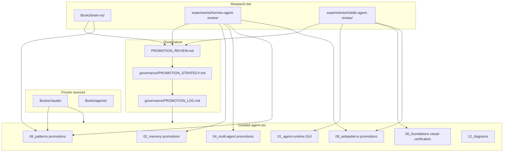

# Provenance Graph

Lineage for Phase 1.2 promoted concepts: source corpus → research sandbox → promotion review → governance → curated integration.

---

## Promotion Lineage Table

| Curated note | Source corpus | Sandbox / research | Review | Governance |
|--------------|---------------|-------------------|--------|------------|
| [[frozen-memory-snapshot]] | — | Hermes `memory/MEMORY_SYSTEM_OVERVIEW.md` | PR §3.1 | PROMOTION_LOG |
| [[memory-char-limits]] | — | Hermes `memory/MEMORY.md` | PR §3.1 | PROMOTION_LOG |
| [[profile-isolation]] | — | Hermes `notes/DIGITAL_TWIN_IMPLICATIONS.md` | PR §3.6 | PROMOTION_LOG |
| [[memory-provider-boundaries]] | — | Hermes `memory/MEMORY_PROVIDERS.md` | PR §3.1 | PROMOTION_LOG |
| [[kanban-vs-delegate]] | — | Hermes `multi-agent/TASK_ORCHESTRATION.md` | PR §3.8 | PROMOTION_LOG |
| [[subagent-tool-restrictions]] | — | Hermes `multi-agent/SUBAGENTS.md` | PR §3.8 | PROMOTION_LOG |
| [[durable-task-coordination]] | — | Hermes `multi-agent/KANBAN.md` | PR §3.8 | PROMOTION_LOG |
| [[gui-agent-loop]] | Harness survey (framing) | MobileAgent `screen-reason-action-feedback-loop.md` | PR §4.1 | PROMOTION_LOG |
| [[visual-grounding]] | — | MobileAgent `visual-grounding-pattern.md` | PR §4.2 | PROMOTION_LOG |
| [[visual-verification]] | — | MobileAgent `action-verification-pattern.md` | PR §4.4 | PROMOTION_LOG |
| [[unverified-gui-clicks]] | — | MobileAgent `anti-patterns/unverified-clicks.md` | PR §4.8 | PROMOTION_LOG |
| [[brittle-gui-automation]] | — | MobileAgent `anti-patterns/brittle-gui-automation.md` | PR §4.8 | PROMOTION_LOG |
| [[mid-session-memory-injection]] | Claude cache context | Hermes ANTI_PATTERNS §2 | PR §3.2 | PROMOTION_LOG |
| [[unbounded-memory-growth]] | — | Hermes ANTI_PATTERNS §1 | PR §3.2 | PROMOTION_LOG |
| [[recursive-self-improvement]] | — | Hermes + Brain OS uncontrolled-adaptation | PR §3.2 | CANONICAL_DIRECTION |
| [[progressive-skill-disclosure]] | Claude ch12 (planned) | Hermes `skills/SKILLS_SYSTEM_OVERVIEW.md` | PR §3.4 | PROMOTION_LOG |
| [[memory-aware-execution]] | — | Hermes memory + Brain OS memory-aware-routing (stripped) | PR §3.1 | PROMOTION_STRATEGY |
| [[verification-before-writeback]] | — | Brain OS evaluation-before-writeback (stripped) | PR §5.5 | PROMOTION_STRATEGY |
| [[fail-closed-agent-loop]] | `Books/claude/ch05`, ch06 | MobileAgent verification | PR §5.5 | PROMOTION_STRATEGY |

---

## Up

- [canonical-vs-research-map.md](canonical-vs-research-map.md)
- [concept-clusters.md](concept-clusters.md)
- [governance/PROMOTION_LOG.md](../../governance/PROMOTION_LOG.md)
