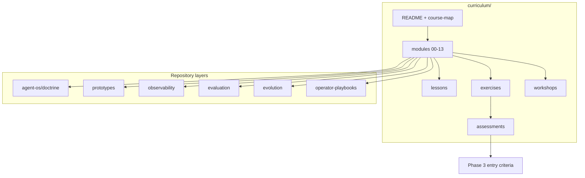

# Curriculum Map

```mermaid
flowchart TB
    subgraph curriculum [curriculum/]
        README[README + course-map]
        MOD[modules 00-13]
        LES[lessons]
        EX[exercises]
        ASM[assessments]
        WS[workshops]
    end
    subgraph repo [Repository layers]
        AO[agent-os/doctrine]
        PT[prototypes]
        OBS[observability]
        EVA[evaluation]
        EVO[evolution]
        OP[operator-playbooks]
    end
    README --> MOD
    MOD --> LES
    MOD --> EX
    EX --> ASM
    MOD --> WS
    MOD --> AO
    MOD --> PT
    MOD --> OBS
    MOD --> EVA
    MOD --> EVO
    MOD --> OP
    ASM --> P3[Phase 3 entry criteria]
```

Student entry: [../student-guides/student-start-here.md](../student-guides/student-start-here.md)
