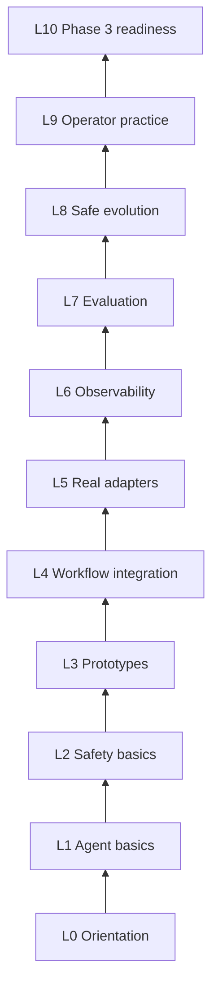

# Learning Ladder

```mermaid
flowchart BT
    L0[L0 Orientation]
    L1[L1 Agent basics]
    L2[L2 Safety basics]
    L3[L3 Prototypes]
    L4[L4 Workflow integration]
    L5[L5 Real adapters]
    L6[L6 Observability]
    L7[L7 Evaluation]
    L8[L8 Safe evolution]
    L9[L9 Operator practice]
    L10[L10 Phase 3 readiness]
    L0 --> L1 --> L2 --> L3 --> L4 --> L5 --> L6 --> L7 --> L8 --> L9 --> L10
```

Detail: [../course-map.md](../course-map.md)

Tracks may skip depth but not safety basics (L0–L2).
