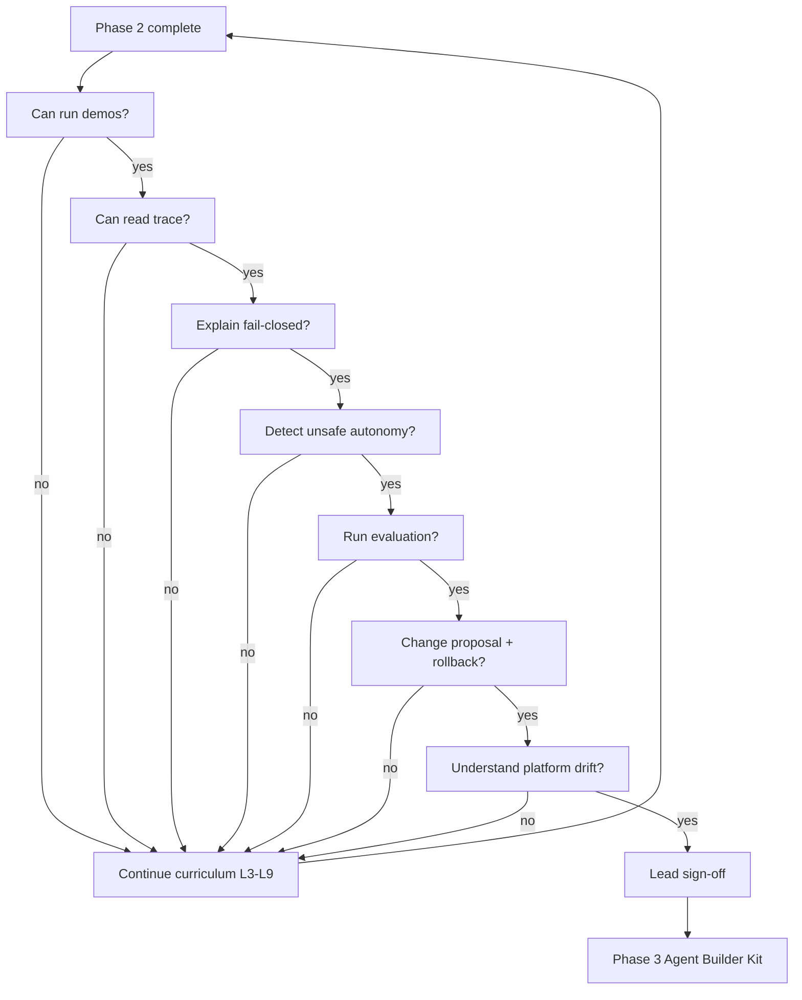

# Phase 3 Readiness Diagram

```mermaid
flowchart TD
    START[Phase 2 complete] --> C1[Can run demos?]
    C1 -->|no| TRAIN[Continue curriculum L3-L9]
    C1 -->|yes| C2[Can read trace?]
    C2 -->|no| TRAIN
    C2 -->|yes| C3[Explain fail-closed?]
    C3 -->|no| TRAIN
    C3 -->|yes| C4[Detect unsafe autonomy?]
    C4 -->|no| TRAIN
    C4 -->|yes| C5[Run evaluation?]
    C5 -->|no| TRAIN
    C5 -->|yes| C6[Change proposal + rollback?]
    C6 -->|no| TRAIN
    C6 -->|yes| C7[Understand platform drift?]
    C7 -->|no| TRAIN
    C7 -->|yes| LEAD[Lead sign-off]
    LEAD --> P3[Phase 3 Agent Builder Kit]
    TRAIN --> START
```

Criteria doc: [../methodology/phase-3-entry-criteria.md](../methodology/phase-3-entry-criteria.md)

**Not ready is normal** — train until all C nodes yes.
