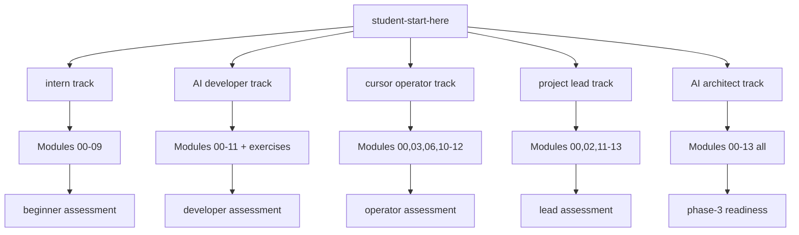

# Role-Based Tracks Diagram

```mermaid
flowchart TB
    ENTRY[student-start-here]
    ENTRY --> I[intern track]
    ENTRY --> D[AI developer track]
    ENTRY --> CO[cursor operator track]
    ENTRY --> PL[project lead track]
    ENTRY --> AR[AI architect track]
    I --> M0[Modules 00-09]
    D --> MALL[Modules 00-11 + exercises]
    CO --> MCO[Modules 00,03,06,10-12]
    PL --> MPL[Modules 00,02,11-13]
    AR --> MFULL[Modules 00-13 all]
    M0 --> AB[beginner assessment]
    MALL --> AD[developer assessment]
    MCO --> OP[operator assessment]
    MPL --> PLA[lead assessment]
    MFULL --> P3A[phase-3 readiness]
```

Files: [../role-based-tracks/](../role-based-tracks/)
