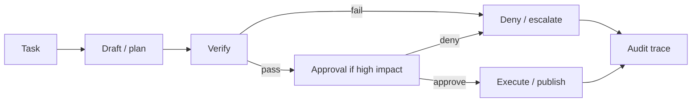

# Safe AI Workflow Learning

Teaching order in curriculum:

1. Verify ([module-03](../modules/module-03-verification-first.md))
2. Approve ([module-04](../modules/module-04-human-approval.md))
3. Fail-closed ([module-06](../modules/module-06-fail-closed-execution.md))
4. Trace ([module-09](../modules/module-09-observability-and-traces.md))

Demo: review-loop + fail-closed-external-action
