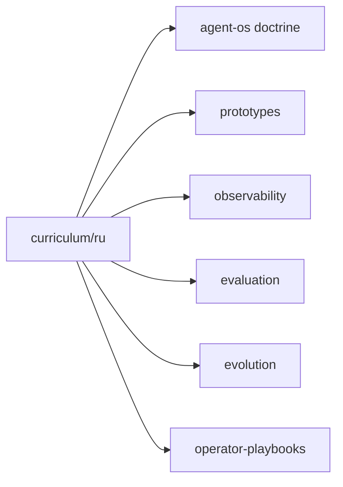

# Карта curriculum

```mermaid
flowchart LR
    CUR[curriculum/ru]
    AO[agent-os doctrine]
    PR[prototypes]
    OB[observability]
    EV[evaluation]
    EVO[evolution]
    OP[operator-playbooks]
    CUR --> AO
    CUR --> PR
    CUR --> OB
    CUR --> EV
    CUR --> EVO
    CUR --> OP
```

Детали: [../course-map.md](../course-map.md)
