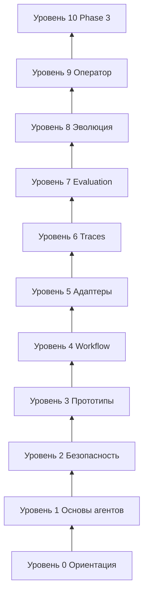

# Лестница обучения

```mermaid
flowchart BT
    L0[Уровень 0 Ориентация]
    L1[Уровень 1 Основы агентов]
    L2[Уровень 2 Безопасность]
    L3[Уровень 3 Прототипы]
    L4[Уровень 4 Workflow]
    L5[Уровень 5 Адаптеры]
    L6[Уровень 6 Traces]
    L7[Уровень 7 Evaluation]
    L8[Уровень 8 Эволюция]
    L9[Уровень 9 Оператор]
    L10[Уровень 10 Phase 3]
    L0 --> L1 --> L2 --> L3 --> L4 --> L5 --> L6 --> L7 --> L8 --> L9 --> L10
```

Треки могут сокращать глубину, но **не** L0–L2.

Подробно: [../course-map.md](../course-map.md)
